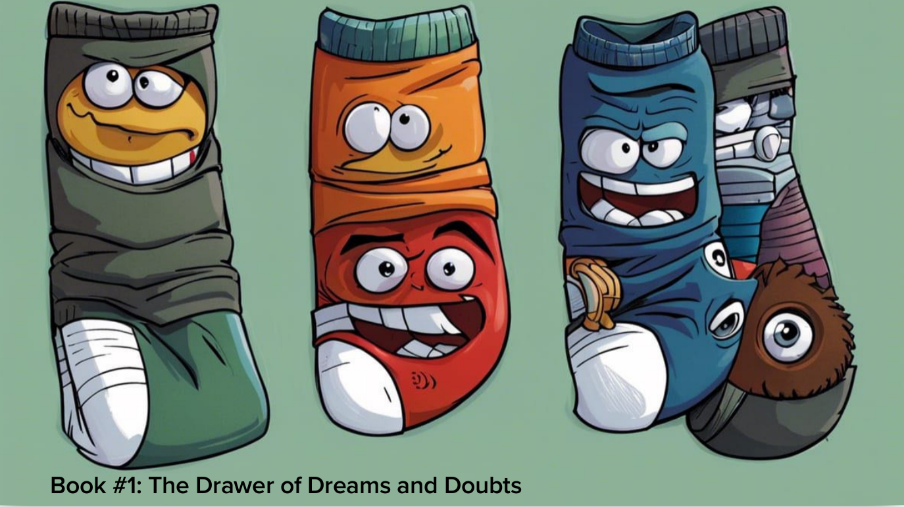
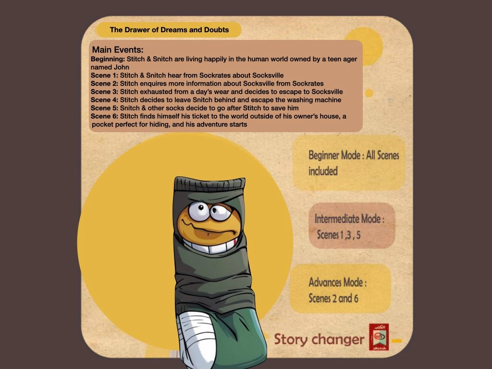

# Comic Crafter: Webcomic Launchpad and Cross-Chain Comic Game Platform


Welcome to Comic Crafter, an innovative webcomic launchpad and comic game platform that seamlessly bridges the worlds of webcomics and gaming across different blockchain networks. Our platform is designed to empower creators, engage communities, and unlock new revenue streams in the realms of storytelling and entertainment. By integrating cutting-edge technologies, we're creating an immersive experience that allows creators to bring their narratives to life, while also enabling gamers to actively participate in the storytelling process.
At Comic Crafter, we've created an inclusive environment that empowers authors, rewards passionate supporters, and captivates a wide audience of readers and players. Each stakeholder plays a crucial role in shaping the interconnected world of webcomics and gaming, fostering a collaborative and vibrant community that thrives on creativity and engagement.


## Key Features:


- **Cross-Chain Transactions:** Harness the potential of Chainlink CCIP for frictionless cross-chain transactions, enabling secure and efficient interactions across different blockchain networks. Purchase books on any CCIP-supported network and mint them on Optimism. Play games across various networks and withdraw revenue to your preferred CCIP-supported chain.
  
- **Optimized Transactions:** Leverage Optimism's fast and cost-effective transaction capabilities, enhancing the overall user experience and encouraging widespread adoption.
- **Webcomic Launchpad:** We kick-start the platform with the first webcomic and its accompanying game, illustrating the dynamic interplay between comic books and the gaming industry.
- **Creator Funding:** Introducing the Launchpad, a space where creators can raise funds for their comic projects. This initiative empowers creators to bring their ideas to fruition and expand their creative horizons.
- **Community-Driven Gaming:** Enabling the community to build engaging games based on the webcomics, fostering a symbiotic relationship between creators and players. The generated revenue is shared amongst creators and the contributing community members.
- **One - Two - Many strategy:** 
  Purchase a Book **once** and receive **Two** NFTs—the book itself and a story card. Leverage the story card for **Many** gameplay experiences, and even create your own story cards within our platform.
  
- **User and Revenue Classification:** Our ecosystem is built around distinct user classifications:
  - **Authors**: CTalented creators who bring their unique narratives to life and mint NFTs for their captivating webcomics. Authors have the opportunity to generate revenue through the sale of their NFT-backed books.

  - **SuperNFT Holders**: Early adopters and avid supporters of the creative community, SuperNFT Holders make a significant impact by acquiring premium NFTs at a higher price. In return, they are entitled to a 50% share of the proceeds from the sale of regular NFTs. Not only do they gain access to exclusive content, but they also actively engage with the webcomics and associated games.

  - **Regular NFT Holders:** Enthusiastic readers and players who engage with the heart of Comic Crafter's ecosystem. By purchasing NFT-backed books, they delve into captivating narratives and immerse themselves in interactive gaming experiences.

- **Story Card NFTs**: With each book, a unique story card NFT is minted. These cards are integral to gameplay, enhancing engagement and interaction within the platform. Players require these story cards to participate in the game, creating an immersive experience that blends storytelling and gaming seamlessly.
  
 
## Economic Value and Impact
Comic Crafter's innovative model creates a self-sustaining economic ecosystem. Authors earn revenue through NFT sales, while SuperNFT Holders enjoy revenue-sharing benefits. The inclusion of story card NFTs introduces a novel dimension, where players become integral to the revenue cycle by purchasing and using these cards for gameplay. This dynamic synergy ensures a continuous flow of value between authors, players, and the broader community, fueling growth and innovation.

## Enhanced Tokenomics through Story Card Trading:
Additionally, our platform empowers users by allowing them to trade the story card NFTs they've generated. This introduces an engaging element of tokenomics, where players actively participate in an evolving marketplace of story cards. As these cards are bought, sold, and traded among players, the platform's token economy gains depth and vitality. This vibrant ecosystem not only enriches the gameplay experience but also strengthens the overall economic fabric of Comic Crafter.
## Tech Stack: 
Comic Crafter is built on a foundation of cutting-edge technologies, including:
  - Solidity programming language
  - Foundry framework
  - Chainlink CCIP for protocol integration
  - support for token standards like ERC1155 and ERC20.
  - Versatile Blockchain Networks: Our platform is launched on  **Optimism Goerli** and **Avalanche Fuji** networks, with plans to extend compatibility to additional networks, creating a vibrant and interconnected ecosystem.
## Getting Started:
To deploy your own instance of Comic Crafter, follow these steps:

1. Install the required dependencies with `forge install`.
2. Use the provided script to deploy your webcomic's NFTs and associated game assets to your chosen blockchain network. For example : `forge script ./script/NFTMinter.sol -vvv --rpc-url optimismGoerli --broadcast --sig "deployReceiver(uint8,uint8)" -- 1 1` where 1 is for optimism , if you want to user other networks check `Helper.sol`
Engage with the community and start exploring the exciting potential of merging comics and gaming.

## Testing
run `forge test`. Feel free to test it against any forked blockchain networks 
## Contribution and Contact:
Community contributions drive the growth of Comic Crafter. Reach out and get involved in shaping the future of webcomics and interactive entertainment.


## License:
Comic Crafter is released under the MIT License, granting you the freedom to use and modify the platform to suit your creative and entrepreneurial needs.

```
Comic Crafter is where storytelling, creativity, and gaming converge. Join us in shaping the future of webcomics and interactive entertainment. Together, we're pioneering a new era of immersive storytelling experiences.
Join us at Comic Crafter, where storytelling, creativity, and gaming converge. Together, we're pioneering a new era of immersive storytelling experiences.

```

